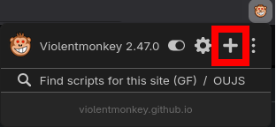

# dota2-kickgsi

Automatically create, manage, and resolve native predictions and show W-L record via OBS.

## Setup

### Configuration

Copy/rename `config_default.json` to `config.json` and configure your settings:
- `gsi_name`: Unique name for the GSI config (e.g. `kickbot`).
- `channel_slug`: Your Kick channel slug (leave empty to auto-detect from dashboard URL).
- `prediction`: Title template, outcome labels, and betting duration.
- `obs`: Starting rank and rank delta per game.

Placeholders available in prediction title template:
- `<match-id>` — current match ID
- `<hero>` — streamer's hero name
- `<time>` — local time (HH:MM)

### GSI File

`<dota2-install>/game/dota/cfg/gamestate_integration/gamestate_integration_<gsi_name>.cfg`

```
"Dota 2 Kick Integration"
{
    "uri"           "http://localhost:4149/gsi"
    "timeout"       "5.0"
    "buffer"        "0.1"
    "throttle"      "0.5"
    "heartbeat"     "30.0"
    "data"
    {
        "map"           "1"
        "player"        "1"
        "hero"          "1"
    }
}
```

### Launch options

You can just run the server manually, you can optionally hack it into the launch options

Windows:

```shell
cmd /c " start "" "<path-to-server-install>" & %command% -novid -gamestateintegration"
```

Linux:

```shell
bash -c "<path-to-server-install>" & %command% -novid -gamestateintegration"
```

### UserJS extension (Violentmonkey etc.)



Paste the contents of `userscript.js`

### Dashboard

Navigate to <https://dashboard.kick.com/stream>

When Dota2 is launched, it'll also launch the middleware that handles all the communication.

### OBS Overlay

Add a **Browser Source** to your scene with the following URL:

```
http://localhost:4149/overlay
```

Recommended settings:

- Width: `400`
- Height: `120`
- Custom CSS: leave empty
- Refresh rate: `1`

The overlay shows:

- Rank image (configurable via `config.json`)
- Current rank (default 1000, +/-25 per game)
- W-L record (auto-updated after each game)

To customize overlay values or prediction templates, edit `config.json` and click **🔄 Reload config.json** in the userscript popup on the Kick dashboard. W-L stats are automatically persisted back to `config.json` when predictions resolve.

## Dev

```shell
uv run backend
```

Build standalone release:

```shell
bash build.sh
```
